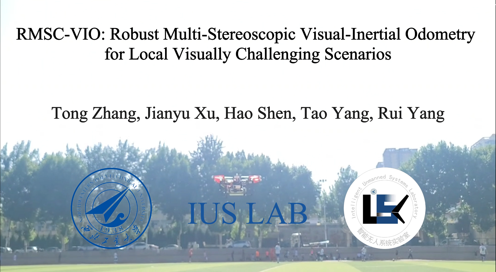

# RMSC-VIO

### RMSC-VIO: Robust Multi-Stereoscopic Visual-Inertial Odometry for Local Visually Challenging Scenarios

We present a Multi-Stereoscopic Visual-Inertial
Odometry (VIO) system capable of integrating an arbitrary
number of stereoscopic views. Firstly, we propose an innovative
initialization scheme and tightly coupled bundle adjustment
method that fully leverage high-quality image feature infor-
mation from different stereo cameras, enhancing the system’s
robustness and effectiveness in local visual challenge scenarios.
Simultaneously, to alleviate the computational burden of multi-
camera systems, we propose an adaptive feature selection
method that iteratively updates and filters out high-quality
image features based on the state information of visual features,
reducing unnecessary redundancy consumption. Finally, we
validate the effectiveness and robustness of our proposed
method through a series of datasets, encompassing various
visually challenging scenarios and practical flight experiments.
Our approach achieves up to a 90% reduction in Absolute
Trajectory Error (ATE) compared to state-of-the-art multi-
camera VIO methods.

Click for the video demo.

## 1. Datasets

    

We collected seven sequences, comprising three indoor and four outdoor scenes. These sequences included challenging visual scenarios. such as featureless environments, frequent occlusions, abrupt lighting changes, overexposure, dynamic objects, and large-scale scenes.
For indoor sequences, we utilized a motion capture system to acquire ground truth poses with millimeter-level accuracy. For outdoor sequences, Real-Time Kinematic (RTK) technology was employed to obtain ground truth trajectories with centimeter-level precision.

### 1.1 [Indoor_topic]
Stereoscopic1: /camera1/infra1/image_rect_raw 15Hz, /camera1/infra2/image_rect_raw 15Hz;
Stereoscopic2: /camera2/infra1/image_rect_raw 15Hz, /camera2/infra2/image_rect_raw 15Hz;
imu: /mavros/imu/data_raw 200Hz;
ground truth: /odometry 100Hz.
### 1.2 [Outdoor_topic]
Stereoscopic1: /camera1/infra1/image_rect_raw 15Hz, /camera1/infra2/image_rect_raw 15Hz;
Stereoscopic2: /camera2/infra1/image_rect_raw 15Hz, /camera2/infra2/image_rect_raw 15Hz;
imu: /mavros/imu/data_raw 200Hz;
ground truth: /mavros/global_position/raw/fix 10Hz.

[RMSC-VIO Datasets](https://pan.baidu.com/s/1vOmaT4yJX6tf_EHAj20-Dw?pwd=RMSC).

